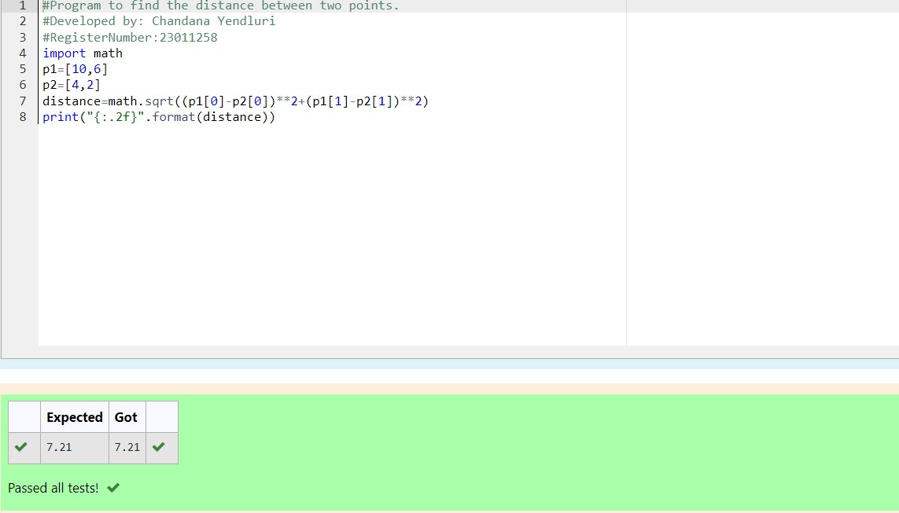

# DISTANCE-BETWEEN-TWO-POINTS

## AIM:
To write a python program to find the distance two 2 points

## ALGORITHM:
### Step 1:
Start the program

### Step 2:
Assign values for the values x2,x1,y2,y1

### Step 3:
Substitute the values in the distance formula formula

### Step 4:
Print the distance format to display the answer with two decimal points

### Step 5:
End the program
### PROGRAM:
  ```
  #Program to find the distance between two points.
#Developed by: Chandana Yendluri
#RegisterNumber:23011258
import math
p1=[10,6]
p2=[4,2]
distance=math.sqrt((p1[0]-p2[0])**2+(p1[1]-p2[1])**2) 
print("{:.2f}".format(distance))
```


### OUTPUT:


### RESULT:
The final answer of the distance between 2 points is given in the output.